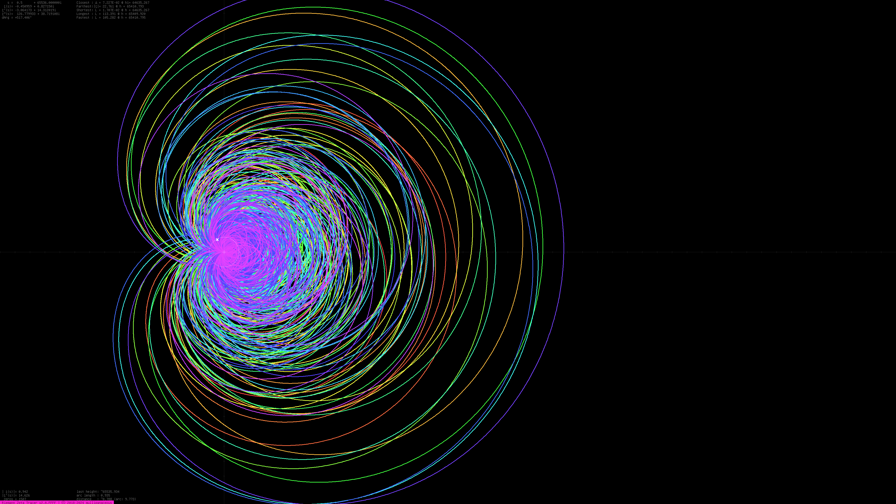
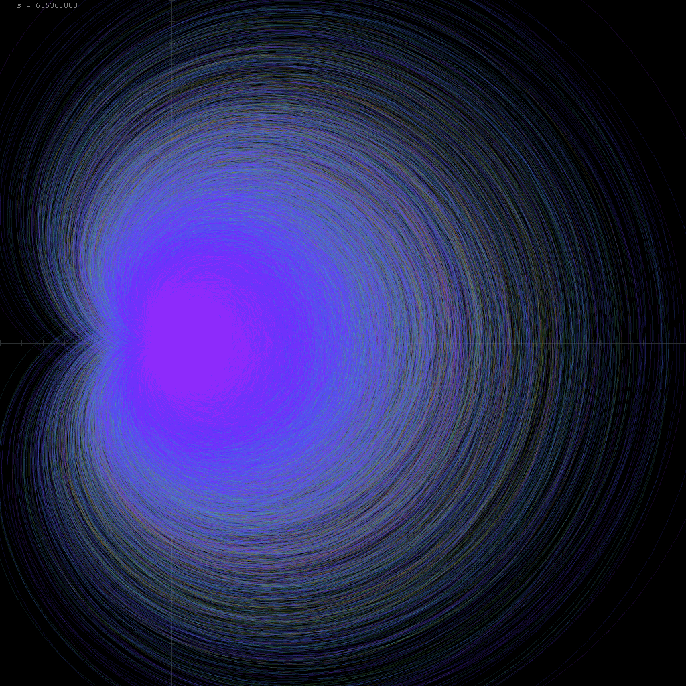
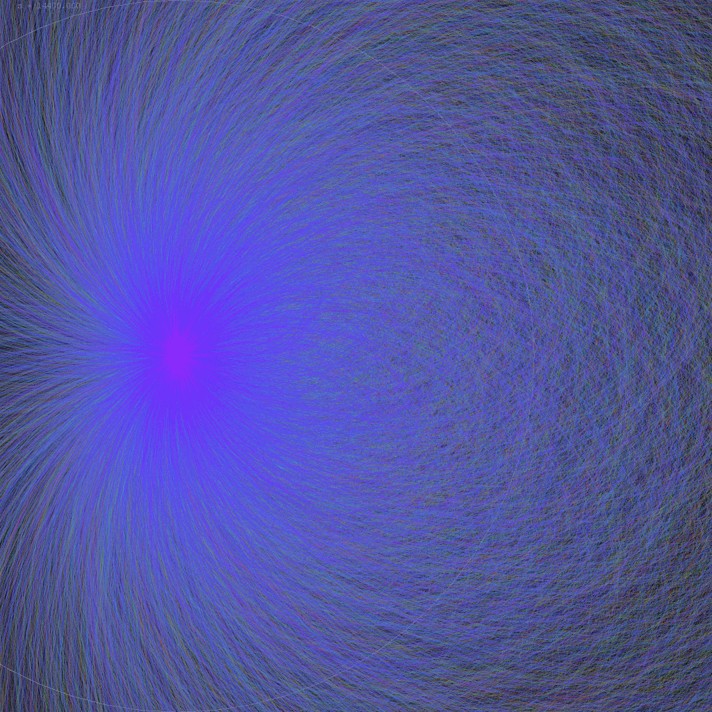
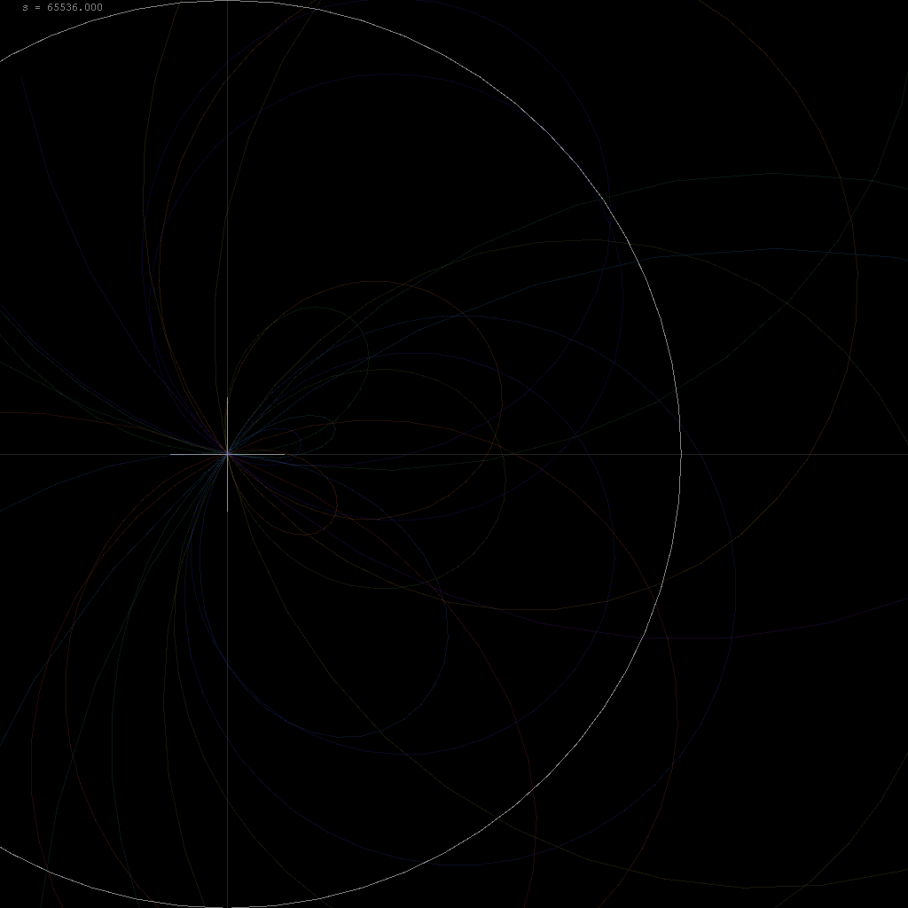
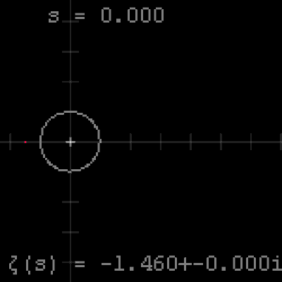
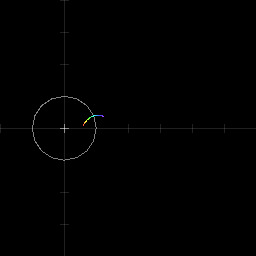
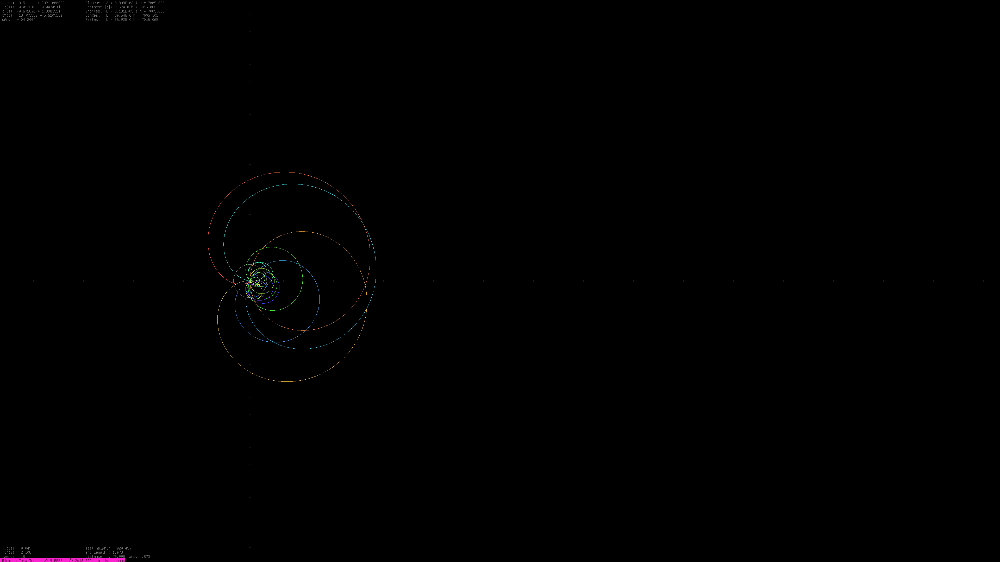

# Riemann Zeta tracer

This is a basic Java Swing program which animates the path of the Riemann zeta function on the critical line.
The trailing part of the path is colored red, while the leading part of the path is colored violet.

This is the program that runs for the **Operation: Hashling** livestream, where Discord starts assigning unique usernames to the remaining users who have not updated their usernames themselves.

* **Highlight:** https://www.youtube.com/watch?v=6XrqDJFJR5k
* **Livestream:** https://www.youtube.com/live/7Mk4GemMQ1M?feature=shared

## How to Run

Presently, there are three basic versions of the Riemann zeta function:

* The unmarked version animates the Riemann zeta function live from height zero.
* The 7005 edition animates the Riemann zeta function from height 7005.
    * This is the famous Lehmer pair.
        * $\gamma_{6709} \approx 7005.0628661749205813803437835888415$
        * $\gamma_{6710} \approx 7005.1005646726467215687204319795170$
    * The two zeroes are separated by a distance of only $\Delta \gamma_{6709} \approx 0.038$.
        * $\Delta \gamma_{6709} \approx 0.0386984977261401883766483906755 \approx 25.840^{-1}$.
        * This is between a twenty-fifth to a twenty-sixth of a unit interval.
    * The two zeroes also have an arc length of $8.131 \times 10^{-3}$ units, the shortest.
    * A comparable scenario occurs earlier at height $5229$.
        * Both the distance and arc length are slightly longer.
* The FFFF edition does not animate the Riemann zeta function, but it calculates the entire path up to height 65536 with resolution 1024 and accuracy level 65536.
    * It will output a 4K version of the image at the end.

While the application is running, the console will output every time it increments by one imaginary unit, when it is about to detect a zero, and when it detects a zero. Additionally, the console will output when new records are being set. These include:

* Farthest distance from origin
* Fastest speed of the curve
* Closest pair of zeta zeroes
* Shortest and longest pair of zeta zeroes in terms of arc length.

This information is also shown live on the GUI, which is currently scaled at 720p.

## Images

### Legacy version I

This version was not officially released. It originated as a 2018 project, and was used as my main profile picture. I have put the project on hiatus in 2019, for four bloody yearrs.
|Image                                 |Description
|--------------------------------------|-----------
|  |Riemann zeta limaçon up to height 65536.
|  |Closeup of the limaçon up to height 14400.
||Closeup of the final segment of the limaçon up to height 65536. The scale is the same as the height 14400 limacon; the circle is the unit circle, and the cross has radius 1/8.
|   |Animation of the first segment of the curve with step size 1/2 and resolution 1/64.
|   |Fast animation of the curve. 

### Swing version

Java Swing is now considered legacy. I will continue to add a couple more versions, and livestream one run in the near future.

|Image                                 |Description
|--------------------------------------|-----------
|   |Riemann zeta limaçon from the Lehmer pair and 16 unit after. The Lehmer arc is not visible at this scale, even at 4K.

## Resources

* [Andrew Odlyzko: Tables of zeros of the Riemann zeta function](https://www-users.cse.umn.edu/~odlyzko/zeta_tables/index.html)
    * Contains downloads of the first hundred zeroes accurate to over 1000 decimal places.
    * Contains downloads of zeroes at zettascale heights.
* [LMFDB](https://www.lmfdb.org/zeros/zeta/)
    * A database containing the first hundred billion zeroes of the Riemann zeta function above the real line, with thirty-digit precision.